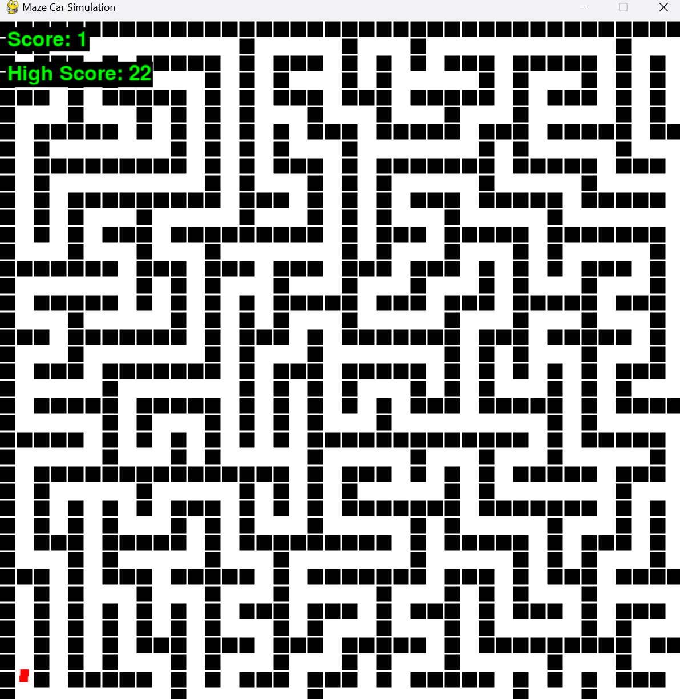

# Maze Driving Simulation



## Project Description

This project is a maze-driving simulation built using Python (pygame)

The objective is for the car (controlled by a Q-learning agent) to navigate through the complex maze to reach the end while avoiding collisions with the walls. If the car touches the wall, it restarts the game. The maze is randomly generated whenever the game is played. 

The maze was created using the depth first search algorithm.

## Features

- **Maze Generation**: A complex, randomly generated maze takes up the full screen, providing a challenging environment for the car.
- **Q-Learning Agent**: The car is controlled by a Q-learning agent, which learns to navigate through the maze.
- **Collision Detection**: If the car touches a wall, the game restarts, and the agent receives a negative reward.
- **Goal Detection**: If the car reaches the goal, the agent is rewarded, and the game restarts with a new maze.
- **Visual Feedback**: The game includes visual elements for the maze, car, and goal, and it displays the current score on the screen.

## Installation

To run this project, you need to have Python and Pygame installed. You can install Pygame using pip:

```bash
pip install pygame
```

## Future

I hope to add a feature that allows the user to play alongside the car but its not yet implemented. Feel free to take the code and modify it anyway.